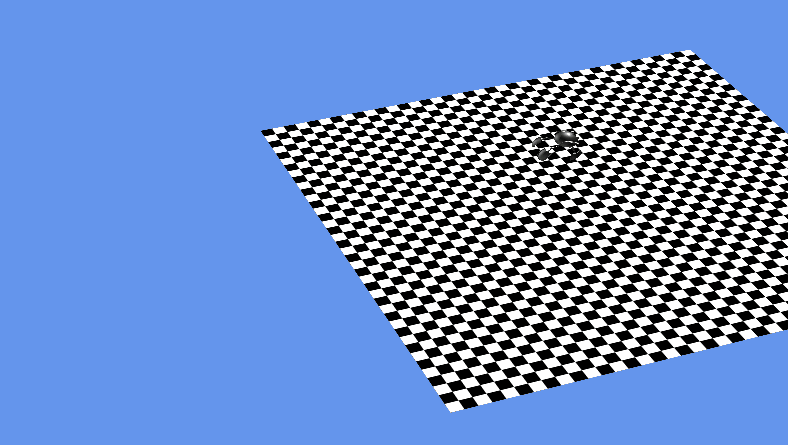

# Drawing 3D graphics with Vertices, and free camera in MonoGame

This is a fork of [ModelsAndVertsMG](https://github.com/xamarin/mobile-samples/tree/master/ModelsAndVertsMG) with free camera view added. The models are the same as the original project. More information can be found on [Drawing 3D Graphics with Vertices in MonoGame](https://web.archive.org/web/20190520060536/https://docs.microsoft.com/en-us/xamarin/graphics-games/monogame/3d/part2).

To navigate in free camera view:
- Hold the right mouse button and
- Change camera veiw using the mouse,
- Use WASD keys to move left, right, forward and backward,
- Use the E and Q keys to move up and down,
- Hold shift to move faster

Todo:
- Use Y axis for up/down direction and Z axis for forward/backward.